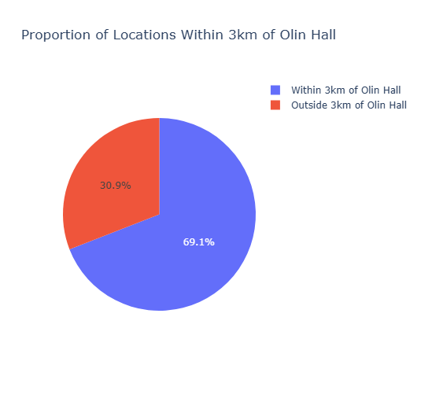

# Creative Solutions in Chemistry

fishera@whitman.edu | +1(408)693-1750

Find my work and I on [LinkedIn](https://www.linkedin.com/in/fisherat/)
or [Handshake](https://app.joinhandshake.com/profiles/fisherat)

### Education
Chemistry, BA - Whitman College (2022-2026)

CA Gold Seal Merit Diploma - Leland High School (2018-2022)

### Ongoing Coursework & Extracurricular Work Experience

**CS-215 - Data Science**

- [Final Project - Cluster & PCA Analysis of Chem Libretexts Bookshelves, an Analysis of Inequity in Opensource Chemical Textbooks](https://fisherat.github.io/CSFinalProjectSp26/)

  

  <iframe src="https://fisherat.github.io/portfolio/assets/graphics/topographical_plot.html" width="100%" height="500px" frameborder="0"></iframe>

- [Interactive Modeling of 2021 Wildfire Incident Locations, built in Observable Java](https://fisherat.github.io/portfolio/assets/graphics/index.html)

- Modeling of Relative Location Data using Plotly, calculated with Haversine

  Hypothesized 90% of timestamped location data within 3km of Whitman College's Olin Hall @46.0728341,-118.3290384
 
  Resulting percentage was ~70% of timestamps within 3km, hypothesis failed

  <iframe src="https://fisherat.github.io/portfolio/assets/graphics/map_locdata_4_27_4.html" width="100%" height="500px" frameborder="0"></iframe>
  
  

**CHEM-490 - Chemistry Senior Thesis**

- Computational Analysis of Metal-Dependent Structural Variations of Acireductone Dioxygenase Enzymes

### Recent Work Experience

**Research Assistant @ Whitman College - Computational Inorg. Biochemistry**

- Metal-Dependent Structural Comparisons of Acireductone Dioxygenases: A Computational Study

  

**Research Assistant @ San Diego St. University - Bacterial Metabolomics**

- Life Under Extremes: Melanin-Mediated Adaptations and Interactions in Arid Soil Microbial Communities

  

**Research Assistant @ Whitman College - Physical Organic Chemistry**

- Summer research continued in Physical Chemistry Laboratory 
- Accessible Solvent Effects on Spontaneous Diphenylalanine Nanostructure Formation for Undergraduates

  <iframe src="https://fisherat.github.io/portfolio/assets/graphics/FisheraPchemLabFinal.pdf" width="100%" height="600px"></iframe>

### Standing Certifications
- Biosafety/Biosecurity - Biohazard Safety
- Laboratory Chemical Safety
- Biosafety/Biosecurity - Recombinant DNA

### Organizations
**National Interfraternity Council**
- Hosted several substance abuse and sexual assault prevention workshops and presentations for Greek Life to audiences of over 100 students, faculty members and members of the local community.
- Officially established a permanent Interfraternity Council scholarship program, expanding and facilitating the use of established resources such as Whitman’s “Brotherhood fund” to support incoming freshmen. 
- Reconnected Whitman IFC with nationals, revising previous bylaws to reflect national standard operating procedures.
- Organized and ran a number of successful fundraising and service events to give back to the community, both in Walla Walla and nationally through Panhellenic’s Circle of Sisterhood.
- Led talks and efforts to align Greek organizations with the interests of the neighboring community to improve daily life and the reputability of our organizations on and around our houses.

**Phi Delta Theta**
- Served as Philanthropy Chair, raising money for ALS research with the Live Like Lou foundation.
- Served as Housing Manager, working as a facilities liaison and organizing house cleanup and maintenance.

### Interests
- Learning something new everyday.
- Research or industry positions interested in improving the world around us. 
